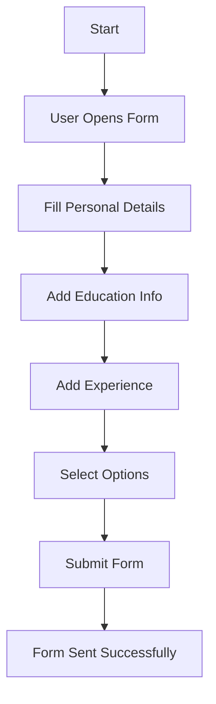

<div align="center">

# ✨ Job Application Page ✨

### 🎯 Responsive Form UI | FreeCodeCamp Workshop Project


</div>


---

## 🚀 Badges


---

## 📌 Overview

A clean and responsive **Job Application Form UI** built using HTML & CSS.  
Focuses on accessibility, structure, and real-world form design practices.

---

## 🧠 Key Features

- 📱 Fully responsive layout  
- 🧾 Structured job application form  
- 👤 Personal & contact details section  
- 🎓 Education & experience inputs  
- 📂 Dropdowns & selection controls  
- ✍️ Additional information text area  
- 🎯 Clean submit button UI  

---

## 🛠️ Tech Stack

| Technology | Purpose |
|------------|--------|
| HTML5 | Structure |
| CSS3 | Styling & Layout |

---

## 📚 What I Learned

- Semantic HTML form structuring  
- Input types & form validation basics  
- Responsive design principles  
- Accessibility using labels & semantics  
- UI styling for real-world forms  

---

## 🔁 Workflow Diagram



---

## 📁 Project Structure

```text
├── index.html
├── styles.css
├── screenshot.png
└── README.md
```

---

## 🎨 UI Highlights

- 📏 Clean spacing system
- 📱 Responsive grid/flex layout
- ♿ Accessible form controls
- ✨ Modern minimal design with dynamic hover shadows

---

## 🔗 Links

- 💻 **GitHub Repo**: [Project Repository](https://github.com/dakshmalviya-x/Job-Application-Page)
- 👤 **LinkedIn**: [Profile](https://www.linkedin.com/in/dakshmalviya/)
- 👨‍💻 **Author**: [Daksh Malviya](https://github.com/dakshmalviya-x)

---

## ⭐ Support

If this project helped you, consider giving it a ⭐ on [GitHub](https://github.com/dakshmalviya-x/Job-Application-Page).
